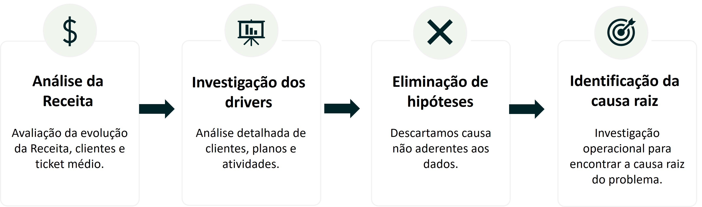
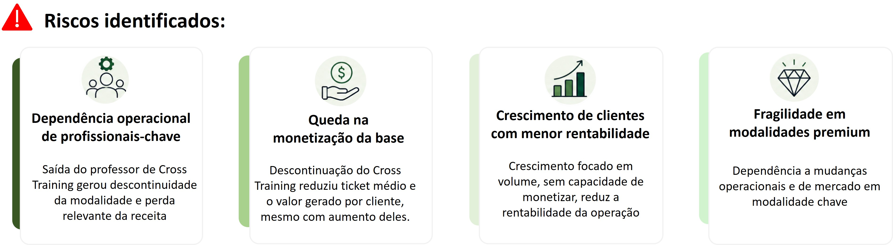
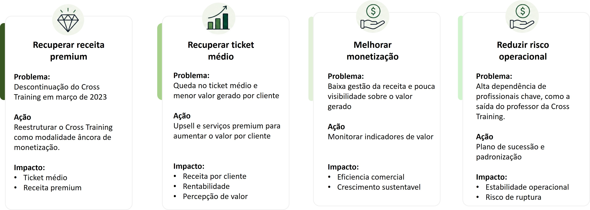
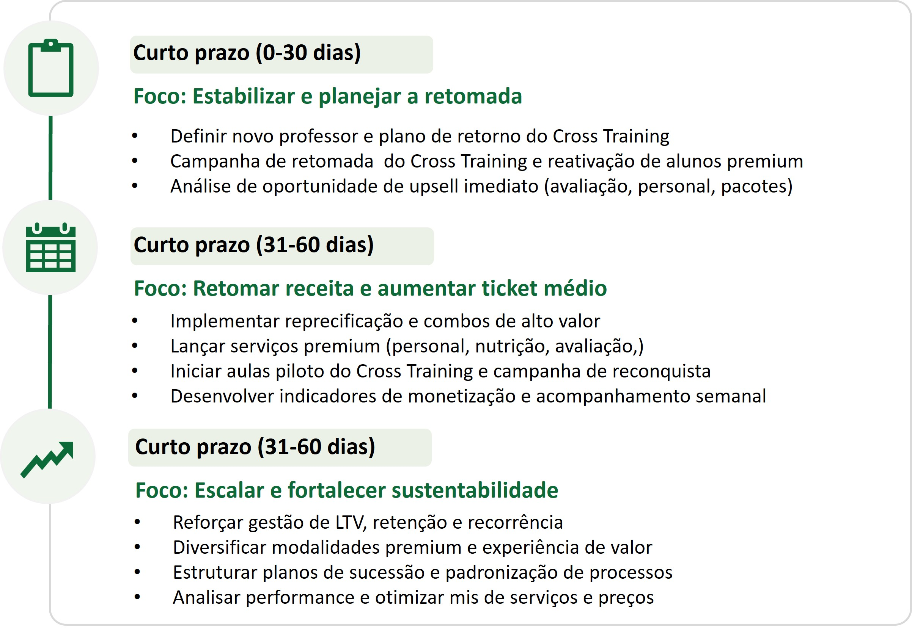

# Objetivo da Análise

Identificar os principais fatores responsáveis pela retração da receita em 2023, apesar do crescimento da base de clientes.

---

# Resumo executivo

## O que aconteceu?

A receita caiu 25% em 2023 VS 2022, devido à perda de monetização da base de clientes, impulsionada pela queda do ticket médio, e pela descontinuação do Cross Training.

## O que identificamos?

- Clientes cresceram 19%,  descartando problema de aquisição
- Ticket médio caiu 37%, indicando deterioração da monetização da base
- Cross Training respondeu por 70% da queda total da receita (-R$ 525 Mil), após a descontinuidade da modalidade em março de 2023.
- Além da descontinuação do Cross Training em março de 2023, a receita foi impactada pela queda do ticket médio. A saída do professor comprometeu a continuidade da modalidade, reduzindo retenção, valor agregado e receita premium.

---

# Contexto do Negócio

A academia apresentou forte crescimento entre 2019 e 2022.

Entretanto, em 2023:

- a receita apresentou retração significativa
- o ticket médio caiu
- a monetização da operação deteriorou

---
# Pergunta de Negócio

> Por que a receita caiu mesmo com aumento da quantidade de clientes?

---

# Metodologia da Investigação

A análise foi conduzida em quatro etapas principais:

---

# Principais Descobertas

## 1) Apesar do crescimento de 19% da base de clientes, o ticket médio caiu 37%, indicando deterioração da monetização

Insight: A empresa continuou expandindo a base de clientes, porem com deterioração significativa do valor médio gerado por cliente.

---

## 2) Queda Distribuída entre os Planos

A retração ocorreu de forma relativamente uniforme entre os planos.

Insight: 
Não houve concentração do problema em um plano específico.
O padrão reforça hipótese de perda de monetização geral da operação.

---

## 3) Cross Training concentrou a maior perda de receita,  e explicou 70% da queda total (- R$ 748 Mil).

Enquanto as demais atividades apresentaram quedas entre -7% e -10%, Cross Training teve retração de -86%, gerando maior impacto negativo da receita.

Insight:
O motivo da queda no faturamento na atividade Cross Trainign, foi a descontinuidade desta modalidade, devido a saída do professor. 

---

# Causa Raiz Identificada

Saída do professor de Cross Training gerou descontinuidade operacional e perda relevante de receita.

insight:
A descontinuação do Cross Training reduziu a capacidade da academia de monetizar a sua base de clientes, deteriorando o ticket médio mesmo com crescimento da operação.

---

# Implicações Estratégicas

## Crescimento sem monetização compromete sustentabilidade da operação

Em 2023, a receita caiu 24%, apesar do crescimento de 19% na base de clientes, devido a queda do ticket médio e a descontinuação do Cross Training em março de 2023.

  
Insight:
Para garantir a sustentabilidade da operação é essencial recuperar a capacidade de monetização, aumentar o ticket médio e reduzir a dependência de fatores críticos

---

# Recomendações Estratégicas

---

# Próximos passos

---
# Competências Demonstradas

✅ Business Analytics  
✅ Storytelling com Dados  
✅ Root Cause Analysis  
✅ Investigação Analítica  
✅ Estratégia de Negócio  
✅ Power BI  
✅ SQL Analytics  
✅ Diagnóstico Executivo  
