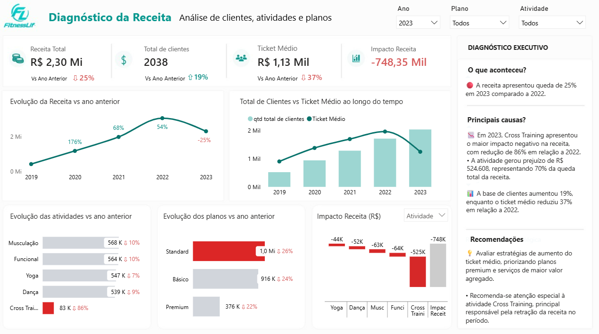
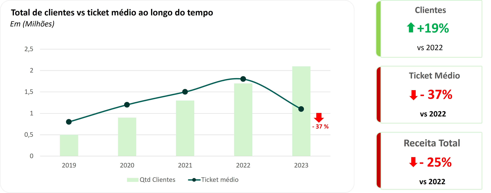
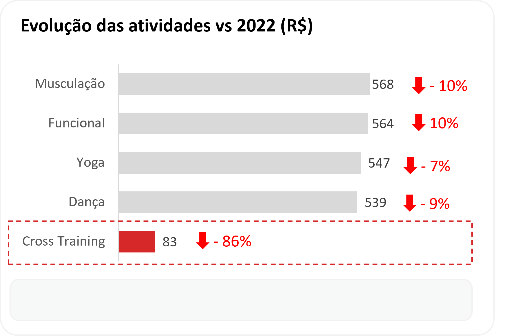
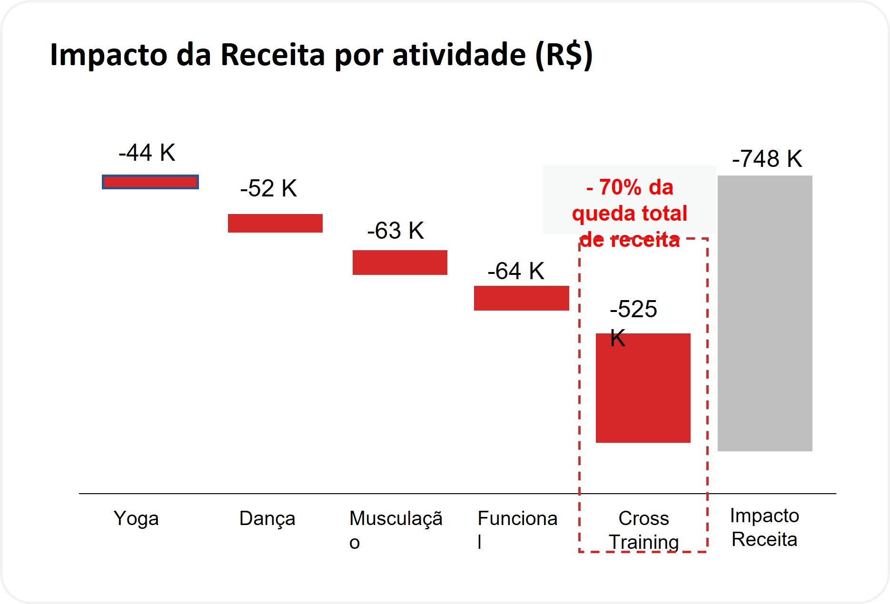
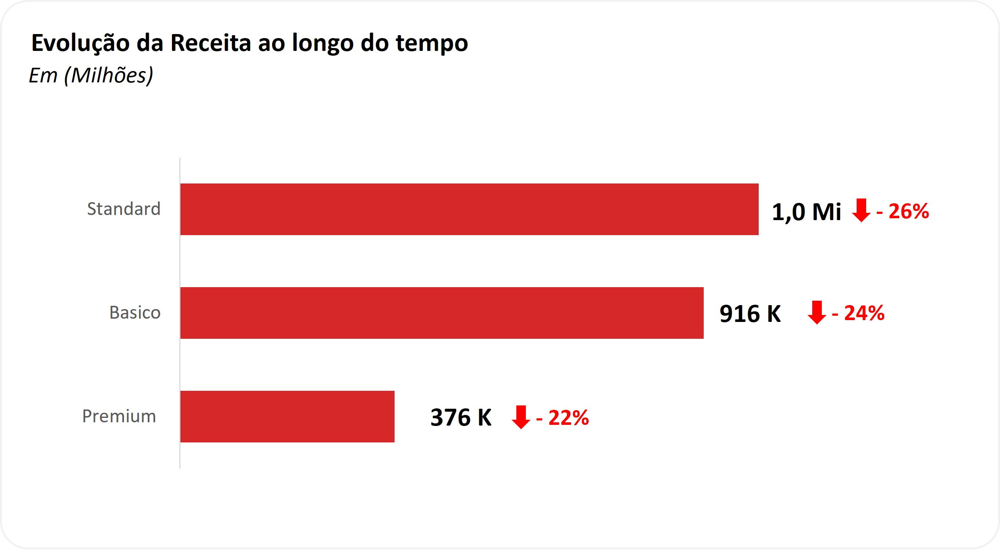

# 📊 Power BI | Analytics

Documentação analítica do dashboard desenvolvido no Power BI.

---

# 🎯 Objetivo

Transformar dados do Data Warehouse em análises executivas e insights estratégicos sobre receita, monetização e performance operacional.

---

# 📌 Dashboard Desenvolvido




---

# 📈 KPIs Desenvolvidos

| KPI | Objetivo |
|---|---|
| Receita Total | Receita geral |
| Clientes Ativos | Quantidade de clientes |
| Ticket Médio | Receita por cliente |
| Crescimento YoY | Crescimento anual |
| Impacto Receita | Diferença financeira |

---

# 📊 Visualizações Desenvolvidas

✅ Evolução da Receita vs Ano Anterior  
✅ Clientes vs Ticket Médio  
✅ Receita por Plano  
✅ Receita por Atividade  
✅ Impacto Financeiro  
✅ Navegação Analítica  

---
## Receita ao longo do tempo



---

## Clientes vs Ticket Médio


---

## Receita por atividade
- receita_atividade.png




---
## Impacto financeiro das atividades




---
## Receita por plano


---

# 📐 Principais Medidas DAX

## Receita Total

```DAX
Receita Total =
SUM(gold_fato_receita[receita])
```

---

## Clientes Ativos

```DAX
Clientes Ativos =
DISTINCTCOUNT(gold_fato_receita[id_cliente])
```

---

## Ticket Médio

```DAX
Ticket Médio =
DIVIDE([Receita Total],[Clientes Ativos])
```

---

## Crescimento YoY

```DAX
Crescimento % =
DIVIDE(
    [Receita Total] -
    CALCULATE(
        [Receita Total],
        DATEADD(dim_data[data],-1,YEAR)
    ),
    CALCULATE(
        [Receita Total],
        DATEADD(dim_data[data],-1,YEAR)
    )
)
```

---

# 🧠 Principais Insights Analíticos

- Receita caiu 25% vs 2022
- Ticket médio reduziu 37%
- Clientes cresceram 19%
- Cross Training concentrou maior impacto financeiro negativo
- Queda ocorreu mesmo com expansão da operação

---

# 🎨 Recursos Utilizados

✅ Power BI  
✅ DAX  
✅ Storytelling com Dados  
✅ KPIs Executivos  
✅ Navegação Analítica  
✅ Comparativos Temporais  
✅ Análise Exploratória  
