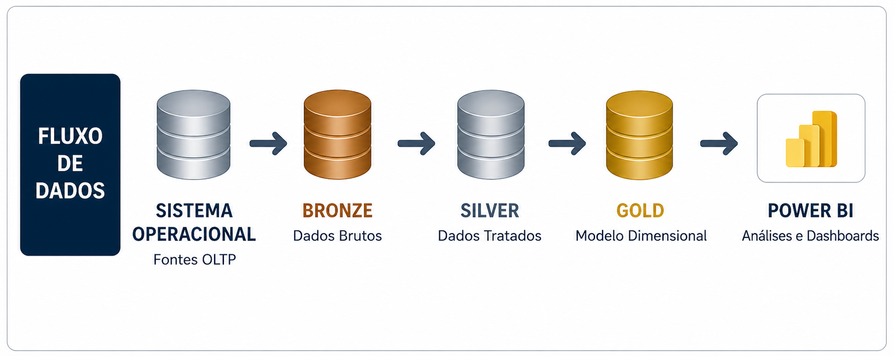

# 📊 Projeto FitnessLife

Projeto completo de análise de dados com:

- SQL Server
- Data Warehouse
- Power BI
- DAX
- Business Analytics
- Storytelling com Dados

---
# 📌 Visão Geral

O projeto foi desenvolvido de ponta a ponta, seguindo uma arquitetura moderna de dados em camadas Bronze, Silver e Gold, contemplando:

- ✅ Criação de Base de Dados
- ✅ Estruturação em Schemas
- ✅ Engenharia de Dados com SQL
- ✅ Tratamento e Qualidade de Dados
- ✅ Modelagem Analítica
- ✅ Views para consumo BI
- ✅ Dashboard Power BI
- ✅ Storytelling Executivo
- ✅ Identificação de Causa Raiz
---

# 🎯 Objetivo do Projeto

Identificar os fatores responsáveis pela queda de receita da academia em 2023, mesmo com crescimento da base de clientes.

---

# ❓ Pergunta de Negócio

> Por que a receita caiu em 2023 apesar do aumento da quantidade de clientes?


---

# 🧱 Arquitetura do Projeto

O projeto foi estruturado utilizando arquitetura medalhão:



---

# 🌳 Estruturação do Problema

A investigação foi conduzida utilizando:


---

# 📌 Principais Insights

| Indicador | Resultado |
|---|---|
| Receita | -25% vs 2022 |
| Clientes | +19% vs 2022 |
| Ticket Médio | -37% vs 2022 |
| Principal Driver | Cross Training - 86% vs 2022 |

---

# 🚨 Diagnóstico Executivo

A receita apresentou retração significativa devido à deterioração da monetização da base de clientes, impulsionada principalmente pela descontinuação da modalidade Cross Training em março de 2023.

A saída do professor responsável pela modalidade comprometeu:

- retenção de clientes
- percepção de valor
- receita premium
- ticket médio

---

# 📈 Dashboard Power BI


---

# 🔍 Principais Descobertas

## 1️⃣ Crescimento sem monetização

Apesar do crescimento da base de clientes de 19%, houve queda relevante de -37% do ticket médio.

## 2️⃣ Queda distribuída entre os planos

Os planos apresentaram retração semelhante, descartando concentração do problema em um único plano.

## 3️⃣ Cross Training concentrou as perdas

A modalidade foi responsável por aproximadamente 70% da queda total da receita, totalizando uma queda de R$-525 Mil. E o motivo foi a saída do professor desta modalidade em março de 2023. 


---

# 📂 Estrutura do Repositório

```bash
FitnessLife
│── README.md
│
├── images/
│
├── PowerBI/
│   ├── README.md
│   └── FitnessLife_Dashboard.pbix
│
├── Scripts/
│   ├── README.md
│   ├── 01_init_database.sql
│   ├── 02_bronze.sql
│   ├── 03_silver.sql
│   ├── 04_gold.sql
│   └── 05_views.sql
│
├── Business Analytics/
│   ├── Apresentação_executiva.pdf

```

---


# 📘 Documentações Técnicas

- [SQL & Data Engineering](https://github.com/VivianeAndrade1988/Projeto_Analise_Receita_FitnessLife/blob/main/Scripts/Readme.md)
- [Power BI & Analytics](https://github.com/VivianeAndrade1988/Projeto_Analise_Receita_FitnessLife/blob/main/Power_BI/Readme.md)

# 📘 Apresentação executiva

Neste link tem toda a análise, desde o entendimento do problema, causa raiz, recomendações e próximos passos.


- [Business Analytics](https://github.com/VivianeAndrade1988/Projeto_Analise_Receita_FitnessLife/blob/main/Business_Analytics/Readme.md).

  

---

# 🚀 Competências Demonstradas

✅ SQL Server  
✅ Data Warehouse  
✅ Arquitetura Medalhão  
✅ ETL / ELT  
✅ Modelagem Dimensional  
✅ Star Schema  
✅ Power BI  
✅ DAX  
✅ Storytelling com Dados  
✅ Raciocinio analítico  
✅ Business Analytics  
