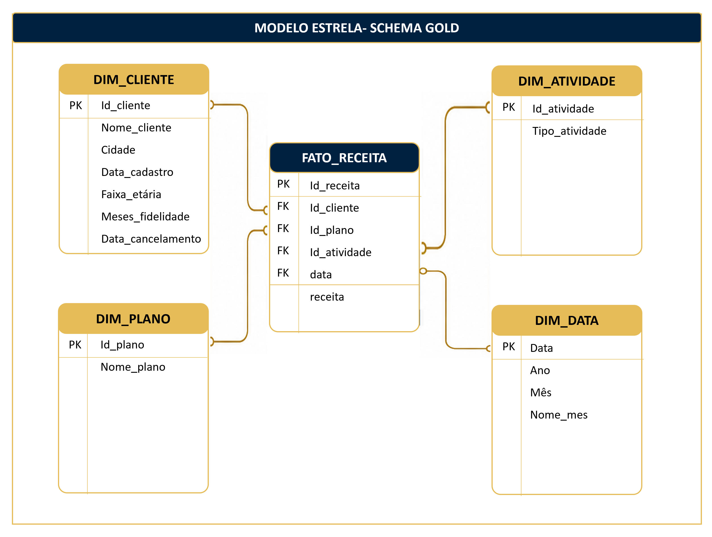

#  SQL Documentação

Documentação técnica da estrutura analítica desenvolvida no SQL Server.

---

#  Objetivo

Construir um ambiente analítico escalável para suportar análises de receita e consumo no Power BI.

---

#  Arquitetura Medalhão

O projeto foi dividido em 3 camadas:

```text
Bronze → Silver → Gold
```

---

#  Estrutura Técnica

## 1️) Inicialização do Banco: 

Foi criado o banco de dados com dados ficticios com apoio da IA, o cenário ficou exatamente como planejei.


```sql
CREATE DATABASE FITNESSLIFE_DW;
```
## Tabelas 

```text
clientes
data
receita
planos
atividades
```
---

## 2️) Criação dos Schemas

```sql
CREATE SCHEMA bronze;
CREATE SCHEMA silver;
CREATE SCHEMA gold;
```

---

#  Camada Bronze (Raw Data)

Responsável por armazenar os dados brutos.

## Objetivos

- Preservar dados originais
- Garantir rastreabilidade
- Permitir reprocessamento

## Tabelas Bronze

```text
bronze_clientes
bronze_data
bronze_receita
bronze_planos
bronze_atividades
```

---

#  Camada Silver (Trusted Data)

Camada responsável por tratamento e padronização.

## Tratamentos realizados

- ✅ Padronização textual
- ✅ Remoção de nulos
- ✅ Correção de tipos
- ✅ Deduplicação
- ✅ Integridade referencial
- ✅ Tratamento de datas

---

#  Camada Gold (Business Layer)

Camada analítica voltada para consumo BI.

## Modelo Dimensional

```text
dim_cliente
dim_data
dim_plano
dim_atividade
fato_receita
```

---

#  Modelo Estrela





---

#  Views Analíticas

## Views criadas

```text
vw_fato_receita
vw_dim_clientes
vw_dim_plano
vw_dim_atividade
vw_dim_data
```

---

#  Queries Analíticas

## Receita por Ano

```sql
SELECT
    ano,
    SUM(receita) AS receita_total
FROM gold.fato_receita
GROUP BY ano
ORDER BY ano;
```

---

## Receita por Plano

```sql
SELECT
    nome_plano,
    ano,
    SUM(receita) AS receita_total
FROM gold.vw_receita_plano
GROUP BY nome_plano, ano;
```

---

## Receita por Atividade

```sql
SELECT
    nome_atividade,
    ano,
    SUM(receita) AS receita_total
FROM gold.vw_receita_atividade
GROUP BY nome_atividade, ano;
```

---

#  Competências Demonstradas

- ✅ SQL Server
- ✅ Engenharia de Dados
- ✅ ETL / ELT
- ✅ Arquitetura Medalhão
- ✅ Data Warehouse
- ✅ Modelagem Dimensional
- ✅ Views Analíticas
